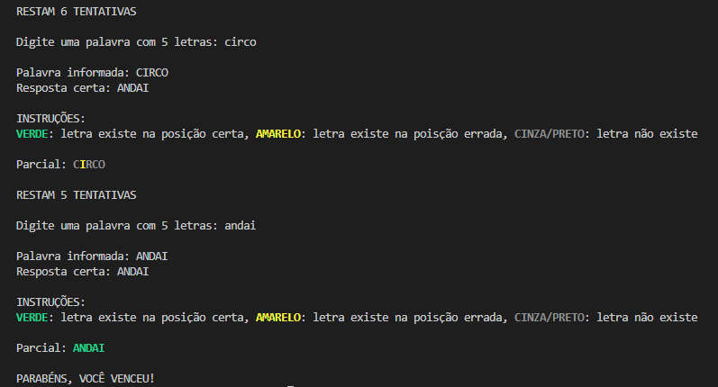

<h1 align="center">Limite</h1>

Limite é um projeto baseado no jogo Wordle desenvolvido como projeto final da disciplina de Linguagem de Programação II.

<h2 align="left">Objetivo:</h2>

Cada vez que o programa é executado será executado um método para sortear uma palavra aleatória dentre mais ou menos 100 mil palavras. O jogador deverá palpitar palavras para chegar perto do resultado. Para isso o programa mostra quais letras e suas posições em relação a palavra digitada. O usuário tem até 6 tentativas para advinhar a palavra.

<h2 align="left">Instruções:</h2>

São sorteadas qualquer palavra presente no dicionário brasileiro fornecido pela USP, podendo conter plurais limitadas a 5 letras. Cada letra que usuário acerta pode estar ou não na posição correta. Caso a letra esteja marcada em VERDE, ela está presente na palavra e na posição correta, caso seja AMARELA a letra está presente na palavra, porém na posição errada e por fim, caso a letra seja da cor cinza/preta a letra não faz parte da palavra.

 

    

